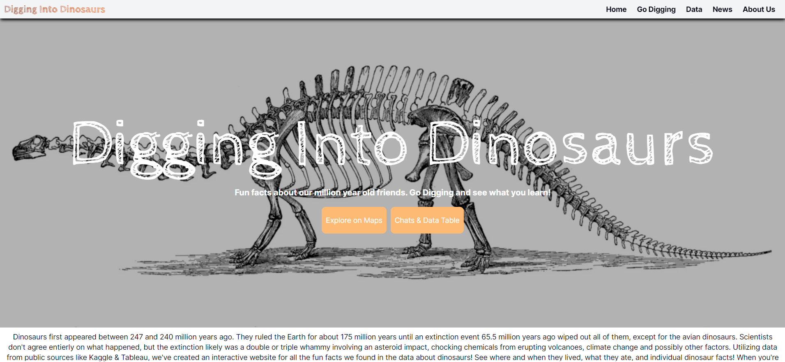
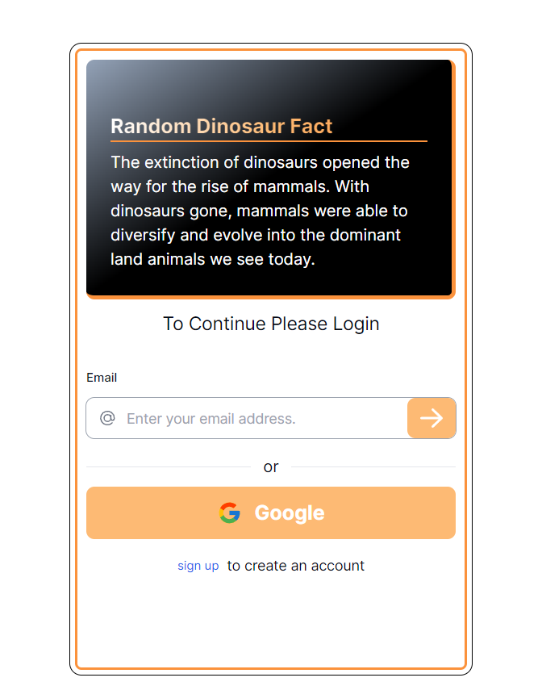
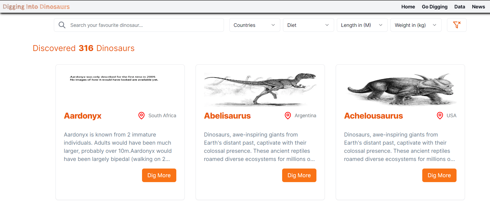
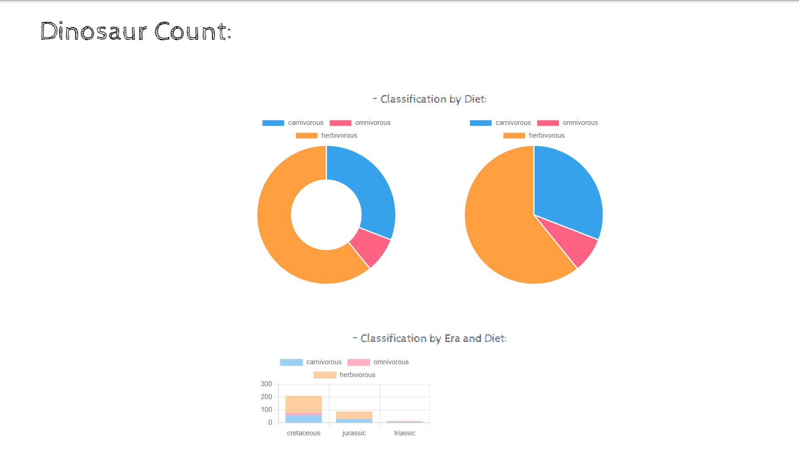
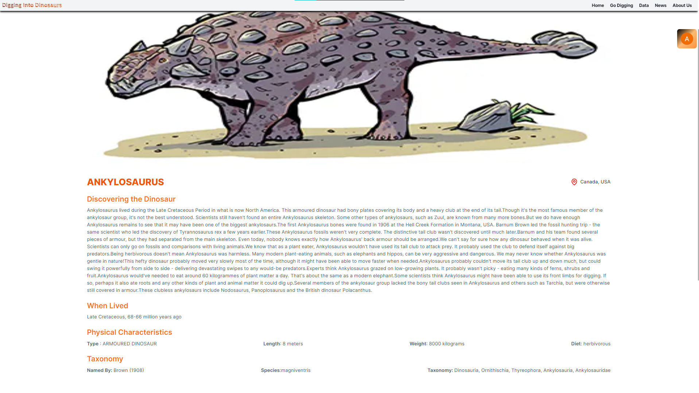
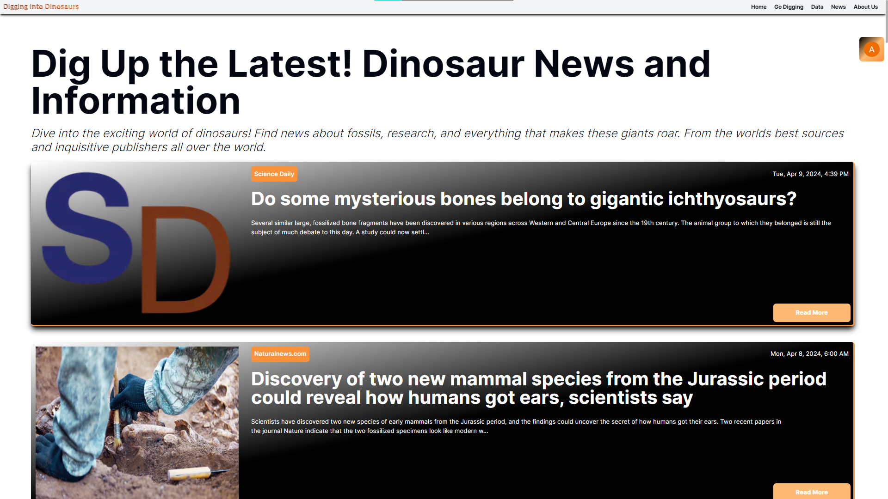

<h1 style="color:orange;font-size:3rem"><a href="https://digging-into-dinosaurs.vercel.app/" style="color:orange">Digging into Dinosaurs</a></h1>

## Overview

Welcome to our dino world, where we bring dinosaurs back to life! Our app is like a virtual dino world, where you can explore various types of dinosaurs from different eras and regions.We've curated a collection of fascinating information about these ancient creatures.Step into our virtual dino world, a realm teeming with the majestic creatures that once ruled the Earth. Powered by meticulous data sourced from the renowned <a href="https://www.nhm.ac.uk/discover/dinosaurs.html" style="color:orange">National History Museum</a>, this app offers an immersive experience like no other, inviting you to embark on a thrilling journey of discovery through the depths of time.

<h3 style="font-size:2rem">Your entry into our Dino world</h3>

 
 

# Features of our App

- <b>User Authentication</b>

  - Users should authenticate themselves before digging into the world of dinosaurs.
  - Authentication system is built using <a style="color:orange"> NextAuth</a>
  - Email verification of the user using a verification email using
    nodemailer

    

- <b>Search Functionality</b>

  - Users can search for dinosaurs by name, weight, length, country and diet.

   

- <b>Diet Chart Visualization</b>

  - Our App displas two charts (pie chart and doughnut chart) illustrating the distribution of general dinosaur diets (e.g., herbivore, carnivore, omnivore) and type based on provided data.
  - The charts accurately represent the proportion of each diet type within the dataset.

    

- <b>Dinosaur Details View</b>

  - Users can view full details of the selected dinosaur.
  - Dinosaur details include notable characteristics sourced from the <a href="https://chinguapi.onrender.com/dinosaurs" style="color:orange">Dinosaurs API</a>.

  

- <b>Dinosaur news and discovery</b>

  - Users will be able to find and read the latest news and discoveries about dinosaurs with the help of <a href="https://newsapi.org/" style="color:orange" >NewsAPI</a> .

    

- <b>Dinosaur over the Map</b>

  - Users will be able to locate the different dinosaurs over different regions using our interactive map built using <a href="https://www.mapbox.com/" style="color:orange">Mapbox Api</a>.
  - User can also filter the dinosaurs on the basis of decades they are found.

    

## Tech Stack Used

- Nextjs
- Prisma
- MongoDB
- ShadcnUi (UI component library)
- Zod (For validation)
- Mapbox (For interactive maps)

## Acknowledgements

We acknowledge the [National History Museum](https://www.nhm.ac.uk) for providing access to the dataset containing valuable information about dinosaurs. Additionally, we thank [NewsAPI](https://www.newsapi.org) for delivering the latest news on dinosaur discoveries, contributing to our ongoing exploration of this fascinating field.

## Our Team

- Jack Weru #1: [GitHub](https://github.com/Jaweki) / [LinkedIn](https://linkedin.com/in/ljaweki-dekut)
- Arman Kumar Jena #2: [GitHub](https://github.com/Ajen07) / [LinkedIn](https://www.linkedin.com/in/arman-kumar-jena-9b6a9322a)
- Shivam #3: [GitHub](https://github.com/shivam24161) / [LinkedIn](https://linkedin.com/in/liaccountname)
- Shant Dashjian #4: [GitHub](https://github.com/shantdashjian) / [LinkedIn](https://www.linkedin.com/in/shantdashjian)
